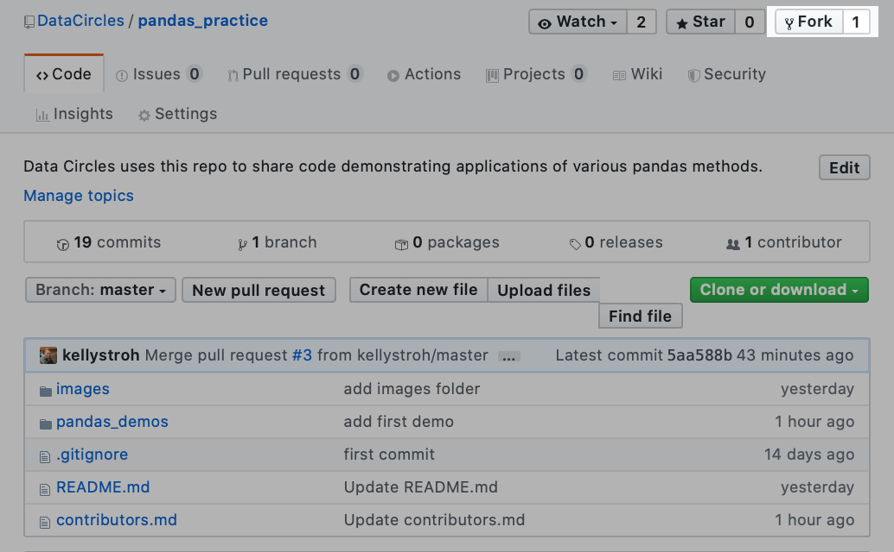
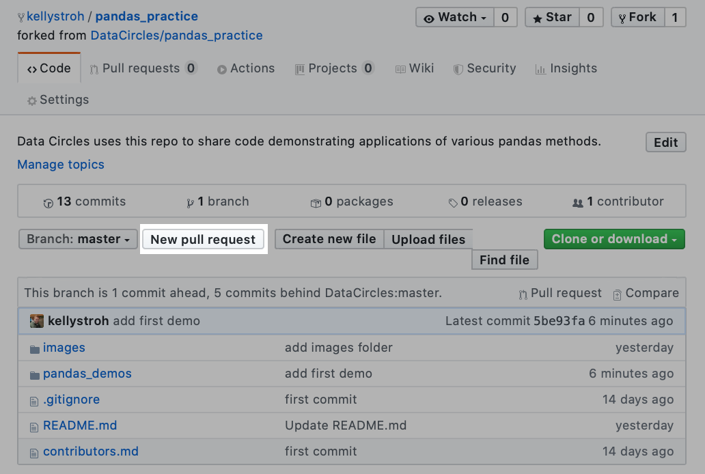
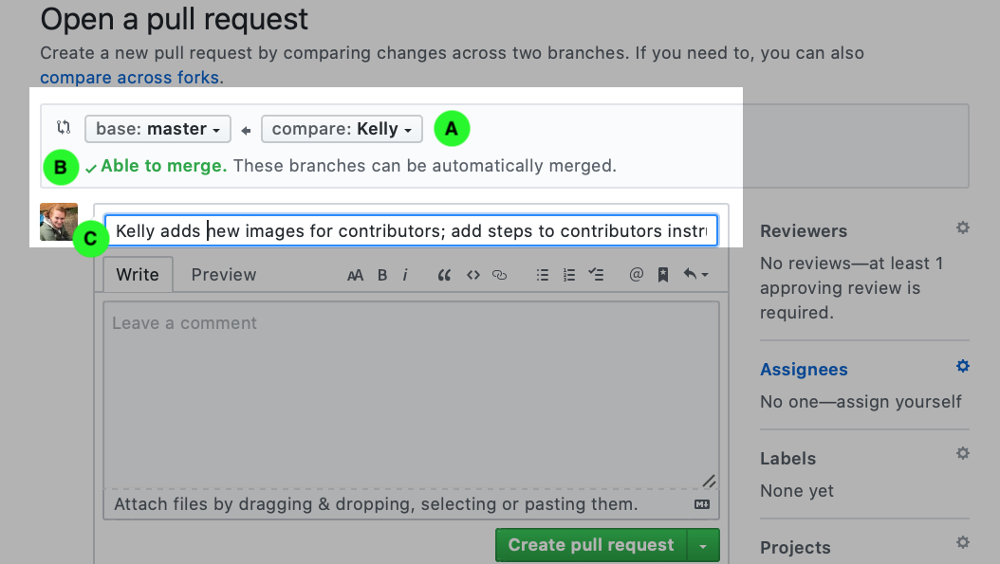
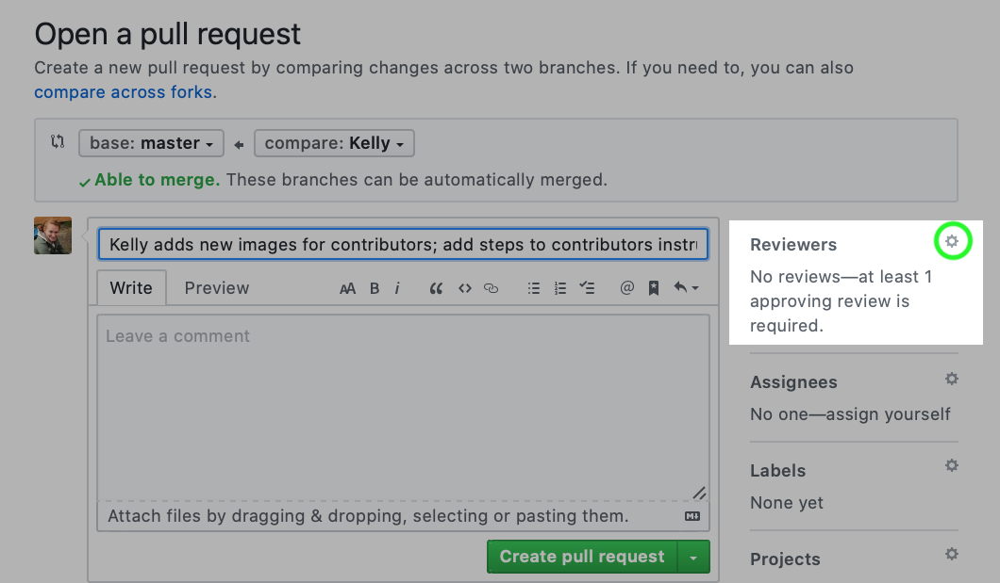
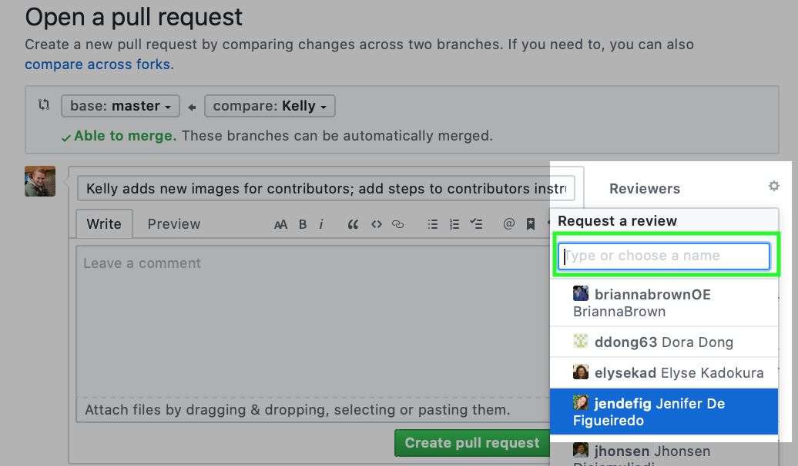

# Contributors Guide

Welcome to the team! Here are the steps to make contributions to this repo:

1. Fork the repository:



2. Clone the repo to your local machine:  
```git clone <link to your fork>```

3. Navigate into the cloned repo & add the Data Circles repo as upstream :

```cd pandas_practice```

```git remote add upstream https://github.com/DataCircles/pandas_practice.git```

4. Navigate into **pandas_demos** & make a new notebook: 

```cd pandas_demos```

```touch <your filename>.ipynb```

5. Run jupyter notebook & code away! 

##### Topic
Please name your notebook after the primary method that you will focus on. You are welcome to provide a demonstration of any pandas method(s). We suggest looking through the existing examples in the Table of Contents to avoid duplication. We hope to introduce people to some of the less common methods, but this is intended for readers and contributors at all skill levels, so there is no wrong choice! 

##### Data
To move your data into your local repo, make a directory called 'data'. This is already included in the .gitignore file, so anything placed into this folder will automatically be ignored by GitHub. This is because GitHub is not designed for data storage, and doesn't allow files above 100 MB. We suggest using data available online, so that you can include instructions for others to access the data needed to reproduce your code. 

6. When you are ready to share your work, commit changes to your branch. 

Check the status of your local repo.
```git status```
Add your file(s). 
```git add <your filename>.ipynb```
```git add <other files>```
Commit changes to your branch.
```git commit -m 'quick summary of changes for your commit message'```
Push changes to your remote branch (on GitHub).
```git push```

8. Open your fork of the repo on GitHub. Click the button for "New pull request". 


10. The next page should automatically populate this information, but it is worth checking three points. A: You should see "compare: <your name>". B: You should see "Able to merge". C: You should see your commit message; if needed, add details to explain the changes you're commiting.


11. Click the gear icon by "Reviewers". You will be able to type in or click on other users. Please select *kellystroh* or *jendefig*. 



12. Click "Create pull request". One of us will review and approve your changes as soon as possible. 
